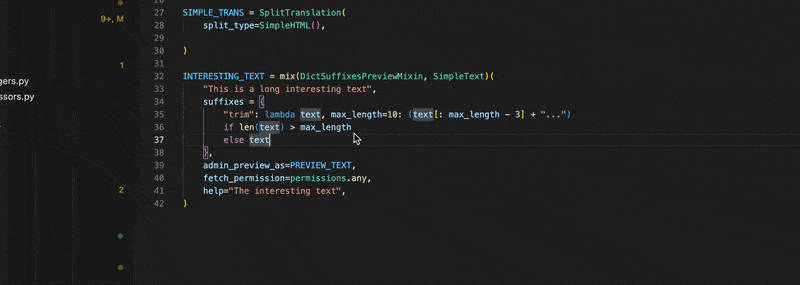
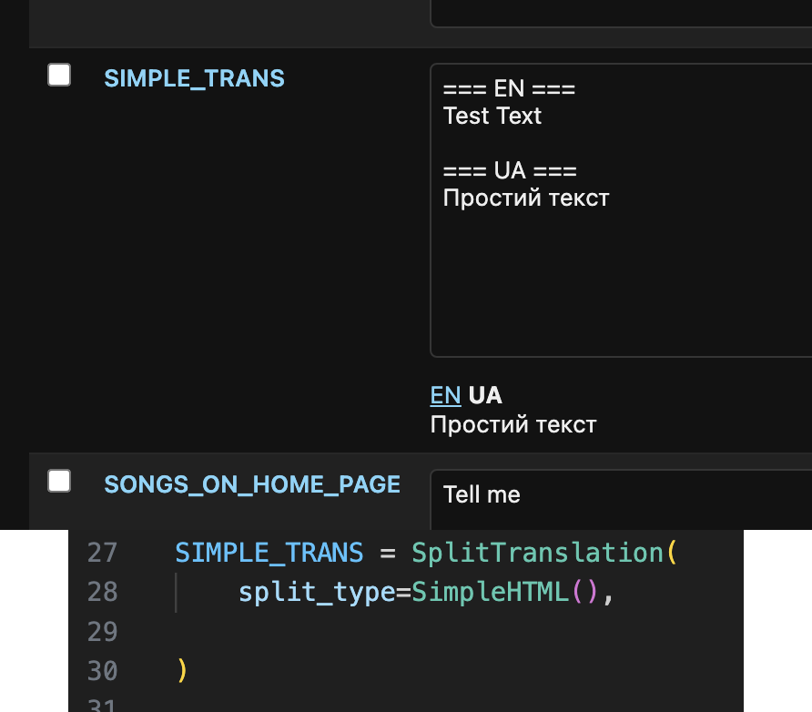

# Changelog

📖 - documentation is required [issue](https://github.com/occipital/django-content-settings/issues/30)

### 0.7.1 help format

* Default preview for Exec and Eval is Python
* SimpleBool more possible input options
* help_format for SplitTranslation
* test covarage: 95%

## 0.7 permissions and content tags

* 📖 __content generated tags__ - tags that can be generated not based on the given tags, but based on the given value.
* 📖 `view_permission` and `view_history_permission`
* 📖 `SimplePassword`
* `json_view_value` returns string

### 0.6.4

* `caching.get_raw_value` - new function
* 📖 `context_manager.process_set` - correct work with str, list and other iterable (those will be converted to set)
* prevent resetting value if only help of tags were updated. The value will be reset to default only in case of version update

### 0.6.3 fix caching for huey and celery

### 0.6.2 SimpleHTML and DjangoModelTemplateMixin

* 📖 new mixin `DjangoModelTemplateMixin` and new types `DjangoModelEval` and `DjangoModelExec`
* 📖 give for `SimpleHTML` is now marked safe, so no need to use `|safe` filter in template
* fix `SimpleEval` and `SimpleExec` permissions
* fix `SimpleStringsList.comment_starts_with`

### 0.6.1 SimpleCSV: you can now set default, required and optional argument for the column type

```python
from content_settings.types import required, optional

var = SimpleCSV(
    csv_fields={
        "name": SimpleString(required),
        "balance": SimpleDecimal("0"),
        "price": SimpleDecimal(optional),
    },
)
```

## 0.6 I18N & suffix preview in admin

* 📖 `types.mixin.AdminPreviewMixin` - build menu on top of preview
* 📖 `types.mixin.AdminPreviewSuffixesMixin` - top menu build based on using suffixes
* 📖 `types.mixin.DictSuffixesPreviewMixin` - mix with `DictSuffixesMixin`



* 📖 `types.array.SplitByFirstLine` - splitting text by multiple suffixes with custom chooser of the default value
* 📖 `types.array.SplitTranslation` - `types.array.SplitByFirstLine` with chooser by the current translation



Minor:

* `validate_value` now splitted on two `validate_raw_value` for validation text and `validate` for validation python object
* 📖 `withtag__NAME` - new built-in prefix, that returns all of the names that have tag "name"
* `help_format` - by default empty text
* `get_admin_preview_as`
* `validate_value` and other validators does not return value
* `get_admin_preview_(self, value, name, **kwargs)` - has now `**kwargs` can be passed from the preview request

## 0.5 User Defined Variables & Constants

* User Defined Variables - variables can now be created not only in code but also in admin
* 📖 `overwrite_user_defined` - new attribute that allows overwrite user defined variable
* 📖 `constant` - new attribute that makes the code variable unchangable in admin panel and only default value is using
* 📖 `conf.register_prefix` - decorator that allows you to registered a new prefix
* 📖 `startswith__NAME` - new built-in prefix, that returns all of the names that starts with NAME
* `dir(content_settings)` - shows all of the registered variables
* db now stores tags and help for all variables
* 📖 `CHECKSUM_USER_KEY_PREFIX` and `USER_DEFINED_TYPES` two new settings
* fix "Preview Loading..." for variables without preview
* `caching.get_type_by_name` - new function
* test covarage: 93%

### 0.4.4

* built-in support huey and celery

### 0.4.3

* fix field validators
* None admin preview by default
* `SimpleHTML` - same as SimpleText but with HTML preview
* `EmailString` - new base type
* `SimpleExec` and `SimpleExecNoArgs` - new types. Works in the same way as SimpleEval, but using exec instead of eval and return values based on `call_return` attribute
* all eval and exec types have `superuser` as default value for `update_permission`
* `MakeCallMixin` has `call` suffix, just in case

### 0.4.2 - local dev fixes

* handeling removed settigs
* `CONTENT_SETTINGS_VALUES_ONLY_FROM_DB` - for DEBUG=False only
* handleling update version during local debug
* preview and updates for non-existed settings

### 0.4.1

* fix admin fields

## 0.4 - suffix and `fetch_groups` deprication

* `lazy_give` new function for giving a lazy object of the type. `LazyObject` has moved to own module `types.lazy`
* deprication of `fetch_groups` attribute and `views.FetchSettingsView` as a replacement
* uppercase for variable name is mandatory
* `call` suffix for `GiveCallMixin`. you can call no-args types like `content_settings.VAN_NAME__call("value")`
* DictSuffixesMixin - use dict for suffixes, where values are lambdas
* `suffix` is URLs for getting value from suffix
* new URL  `fetch/<str:name>/suffix/<str:suffix>/`
* test covarage: 89%


## 0.3 - "give" control and admin preview refactoring

* `give` and `give_python` - new base method allows Type to control how the cached value will be given to the code. See the [Cookbook](cookbook.md) for usecases
* new mixins `GiveCallMixin` and `MakeCallMixin`
* new classes based on `GiveCallMixin` - `DjangoTemplateNoArgs` and `SimpleEvalNoArgs`
* Admin Preview refactoring:
    * `admin_preview_as` new base-class attribute. Possible values html/text/python
    * `preview_validators` new `CallToPythonMixin` attribute. A list/tuple of all validators for preview
    * `admin_preview_call` new `CallToPythonMixin` bool attribute. Should function execution be shown in preview
* `template_static_includes` - new attrubite for `SimpleCallTemplate`. 

## 0.2.3 - advanced context_managers

* `context_manangers`
    * parameter `init` for processors in `context_defaults`. You can now not only update default values, but also update assigned values
    * new processors: `add_tags`, `remove_tags`, `str_append`, `str_prepend`, `str_format`, `help_format`
* new [django setting](settings.md): `CONTENT_SETTINGS_CONTEXT_PROCESSORS` and `CONTENT_SETTINGS_CONTEXT_PROCESSORS` - you can now set a default context
* support default tags for types
* add default tags for templates and markups types
* add `superuser` in `permissions`
* fix: `content_settings_context`
* test coverage: 87%
