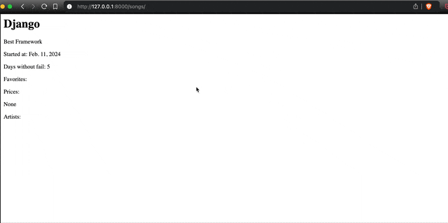

[](https://stand-with-ukraine.pp.ua)


# Django Content Settings - The Most Advanced Admin Editable Setting

[](https://github.com/occipital/django-content-settings/stargazers)

The `django-content-settings` module is a versatile addition to the Django ecosystem, allowing users to easily create and manage editable variables directly from the Django admin panel. What sets this module apart is its capability to handle variables of any type, without limiting their complexity. Thanks to an integrated caching system, these variables can be used efficiently in code, regardless of their complexity.



`django-content-settings` allows you to store variables with specific functionality in your code that can be validated and previewed in your Django admin panel. Validators, previewers, and all associated logic are defined in the setting configuration.

### Key Features

1. **Type-Agnostic Variable Creation**: Create variables of any type, making the module highly adaptable to diverse needs. [Learn more about basic types](types.md) and [template types](template_types.md).
2. **Flexible Permission Model**: Define custom permission rules for viewing, editing, fetching in APIs, and viewing the change history of each setting. [Learn more about the available API](api.md).
3. **Preview Functionality**: Preview settings before applying them, with the option to view changes directly on the site.
4. **Export & Import**: Export and import configurations in bulk using the UI or command-line tools.
5. **Editability via Django Admin Panel**: Seamlessly edit variables directly within the Django admin panel. [See how the Django Admin interface looks](ui.md).
6. **Caching System**: Optimized performance ensures variable complexity does not impact execution speed. [Learn more about caching and speed optimization](caching.md).
7. **Extensions**: Leverage a wide array of configuration options and extension points. [Explore available extensions](extends.md).

### Additional Admin Panel Functionalities

- **Change History**: Track and review changes made to variables.
- **Preview System**: Preview changes for different variable types before applying them.
- **Bulk Editing**: Edit multiple variables simultaneously.
- **Permission System**: Implement granular edit permissions for enhanced security and management.
- **Tags Navigation**: Organize settings with tags, enabling flexible navigation even with 1,000+ settings in the system.

[Learn more about these features here](ui.md).

### How It Works

- **Setup**: Follow the [step-by-step instructions here](first.md).

- **Define the Setting**: Add a constant in `content_settings.py` within your app.

```python
# content_settings.py

from content_settings.types.basic import SimpleString

TITLE = SimpleString("Songs", help="The title of the site")
```

The code above defines a variable `TITLE` with the type `SimpleString` and the default value `"Songs"`.

- **Migrate**: Run migrations to enable editing raw values in the Django Admin panel.

```bash
$ python manage.py migrate
```

You can use the setting in your code without running migrations, but migrations are required to make the setting editable in the admin panel.

- **Use It in Your Project**: Access the `TITLE` setting in your code.

```python
from content_settings.conf import content_settings

content_settings.TITLE
```

Alternatively, use the `settings` object to unify content settings and Django settings:

```python
from content_settings.conf import settings

settings.TITLE
```

In a template:

```html
<h2>{{ CONTENT_SETTINGS.TITLE }}</h2>
```

[Learn more about accessing settings](access.md).

### Quick Look

You can quickly explore the functionality using the `cs_test` project in the [repository](https://github.com/occipital/django-content-settings). Ensure you have [Poetry](https://python-poetry.org/) installed.

```bash
$ git clone https://github.com/occipital/django-content-settings.git
$ cd django-content-settings
$ make init
$ make cs-test-migrate
$ make cs-test
```

Open `http://localhost:8000/admin/` in your browser to access the Django admin panel.

- Username: `admin`
- Password: `1`

# What's Next?

- [**Getting Started**](first.md): Step-by-step guide to configuring content settings in your project and adding your first setting.
- [**Setting Types and Attributes**](types.md): Guide to all available basic types and attributes, with examples.
- [**Template Types**](template_types.md): The most powerful feature of content settings, where raw values are text, but the setting value is a function.
- [**Using Settings**](access.md): Explore multiple ways to access content settings in your project.
- [**Permissions**](permissions.md): Define distinct permissions for different settings' functionality.
- [**Defaults Context**](defaults.md): Group settings with common parameters to reduce redundancy and maintain cleaner code.
- [**API & Views**](api.md): Organize access to content settings via APIs.
- [**User Interface for Django Admin**](ui.md): End-user guide to using the Django Admin panel for content settings.
- [**How Caching is Organized**](caching.md): Ensure fast and efficient content settings performance, with configurable options.
- [**Available Django Settings**](settings.md): Reference all available Django settings for content settings.
- [**User-Defined Settings**](uservar.md): *Experimental functionality* for allowing Django Admin users to create settings directly from the UI.
- [**Possible Extensions**](extends.md): *WIP* - Extend the basic functionality of content settings.
- [**Cookbook**](cookbook.md): Practical recipes for using content settings in your project.
- [**Frequently Asked Questions**](faq.md): Answers to common questions.
- [**Glossary**](glossary.md): Definitions of terms introduced by the concept of content settings.
- [**How to Contribute**](contribute.md): Guidelines for contributing to the project.
- [**Changelog**](changelog.md): Overview of updates introduced in each version.
- [**Source Doc**](source.md): Compilation of docstrings for future reference.
