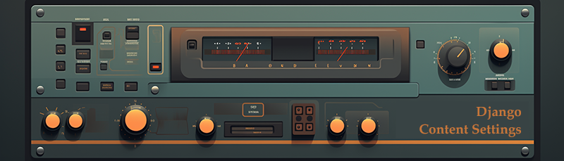

[](https://stand-with-ukraine.pp.ua)

[](https://github.com/psf/black)



# Django Content Settings - the most advanced admin editable setting

[▶️ YouTube Video with dive deep ~ 2h](https://youtu.be/RNYmvv_G5zs)

The `django-content-settings` module is a versatile addition to the Django ecosystem, offering users the ability to easily create and manage editable variables directly from the Django admin panel. What sets this module apart is its ability to handle variables of any type without restricting their complexity. Thanks to an integrated caching system, these variables can be used efficiently in code, irrespective of their complexity.

### Key Features

1. **Type-Agnostic Variable Creation**: Users can create variables of any type, making the module highly adaptable to various needs.
2. **Editability from Django Admin Panel**: Seamless integration with the Django admin panel allows for effortless editing of variables.
3. **Flaxable permission model**: Every setting can have own permission rule for view, edit, fetch in API and view changes history.
4. **Preview**: Preview setting before apply and addition option to preview setting change right on site.
5. **Caching System**: Ensures high performance, negating the impact of variable complexity on code execution speed.

### Additional Admin Panel Functionalities

- **Change History**: Track and review the history of changes made to the variables.
- **Preview System**: Preview changes for different variable types before finalizing them.
- **Bulk Editing**: Facilitate the simultaneous editing of multiple variable types.
- **Permission System**: Control edit permissions for enhanced security and management.

### API Integration

The module comes with a built-in API system, enabling:

- **Reading of Individual or Group Variables**: Allows for flexible data retrieval.
- **Access Permissions**: Manage who can read the variables, ensuring data privacy and security.

### How does it look

*[glossary](glossary.md)*

- **Setup**. [Here](https://django-content-settings.readthedocs.io/en/latest/first/) you can get step-by-step instruction.

- **Define the setting**. To do so you need to define constant in `content_settings.py` in your app

```python
# content_settings.py

from content_settings.types.basic import SimpleString

TITLE = SimpleString("Songs", help="The title of the site")
```

the code above defines a variable `TITLE`, with type `SimpleString` and default value `Songs`.

- **Migrate**. In order to be able to edit *raw value* in Django Admin

```bash
$ python manage.py migrate
```

Technically, you can *use setting* in code even without migration. The migration is need to make setting editable in admin panel

- **Use it in your project**. That is it. You can *use setting* `TITLE` in your code. 

```python

from content_settings.conf import content_settings

content_settings.TITLE
```

or use object `settings` that unites content settings and django settings in one place

```python

from content_settings.conf import settings

settings.TITLE
```

In template:

```html
<h2>{{CONTENT_SETTINGS.TITLE}}</h2>
```

if you want to use `{{SETTINGS}}` as an object that unites settings and content settings, replace `"content_settings.context_processors.content_settings"` with `"content_settings.context_processors.settings"`

In API:

```bash
$ curl http://127.0.0.1/content-settings/fetch/title/
```

Ok, I lied, in order to use in API you need to update permission from the setting:

```python
# content_settings.py

from content_settings.types.basic import SimpleString
from content_settings import permissions

TITLE = SimpleString(
    "Songs",
    fetch_permission=permissions.any,
    help="The title of the site",
)
```

Simple as that, we have a lot of *setting types* you can use `SimpleText`, `SimpleHTML`, `SimpleInt`, `SimpleBool`, `SimpleDecimal`, `DateTimeString`, `SimpleTimedelta`, `SimpleYAML`, `SimpleJSON`, `SimpleCSV`, `DjangoTemplate`, `DjangoModelTemplate`, `SimpleEval`, `SimpleExec` and so on... [Read more](https://django-content-settings.readthedocs.io/en/latest/types/) about the types available for you.

It is also very fast thanks to our caching system. [Read more about it](https://django-content-settings.readthedocs.io/en/latest/caching/).

Some fancy things you can find in our [cookbook](https://django-content-settings.readthedocs.io/en/latest/cookbook/).