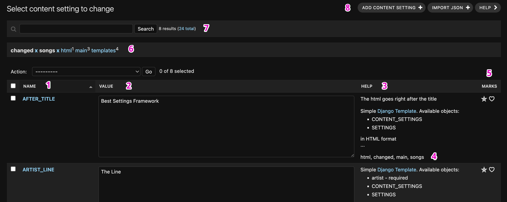

# User Interface for Django Admin

This guide helps you understand how to use the Django Admin Panel for editing your content settings. This is a user guide, assuming you have a "developer" role in your team and it shouldn't be you.

## Workflow

### Django Admin

The content settings section of Django Admin consists of two links:

* **Content settings** - This lists all available settings in the system. Use this section to update or create settings in special cases.
* **History content settings** - This shows the history of all changes in content settings. Here you can see not only when a user made a change but also when the system made a change.

### List of Available Settings

When you click on "Content settings" in the Django admin, you will see a list of all available content settings.

Here are the main elements of the list:

* (1) **Column "Name"** - The unique name of the setting. Each name is also a link to a unique edit setting form.
* (2) **Column "Value"** - The value of the setting. When you edit the value, you might see a preview of the value (see the picture). Note that changing the value in the textarea doesn't update the setting until you hit the "Save" button (10).

* (3) **Column "Help"** - Information about the setting's purpose and format. Clicking on "..." at the end of the information shows system information about the setting.
* (4) **Column "Tags"** - A list of tags associated with the setting. At the top panel, you can filter the list by choosing a tag (6).
* (5) **Column "Marks"** - You can add a specific mark for the setting by clicking on any of the icons in the column. The chosen mark is visible only to you, and you should be able to filter by the mark in the future. *The list of available marks is customizable by the developer.*
* (6) **Filter by tags** - You can filter the list of settings by clicking on a tag name in the filter. If you click on a tag "main," only settings with the "main" tag will be shown. You can cancel the filter by clicking "X" after the name of the chosen tag or add one more tag in the filter.

* (7) **Search filter** - You can use this field to find a specific setting you need. The search phrase you enter is used to find a setting by name, help, or tag.
* (8) **Add content setting** - You can add your own setting. If the button is not activated for you, the function is not enabled by the developer.
* (9) **Preview on site** - Allows you to see the changes on the site, but only for you. Make the changes, enable "Preview on site," and click "Save." More about this can be read further in the article.
* (10) **Save** - The button you should click to apply all of the changes.

### Edit Setting Page

When you click on the name of a setting in the list, you will go to the edit setting page, which has similar functionality to the list settings but for an individual setting.

Here are the elements of the page:

* (1) **Value** - The value of the setting.
* (2) **Py data** - Preview of the setting (the same preview you see on the list of settings below the value field).
* (3) **Help** - Information about the setting's purpose and format.
* (4) **Tags** - The list of tags for the setting.
* (5) **Default value** - The initial value that was used when the setting was added to the system, before any user changed it. With the "reset" button, you can update the current value to the default value, but only in the value field. To apply that change, you need to hit the "Save" (7) button.
* (6) **Preview on site** - Works the same way as the preview on site for the list of settings.
* (7) **Save** - Button to apply changes in the value field. After that, you will be redirected to the list of settings page.
* (8) **Save and continue editing** - Same as Save, but you wouldn't be redirected and stay on the page.
* (9) **Save and add another** - This will be shown if you can add new settings in the system using the Django panel.

## Apply Multiple Settings at Once

It is very important to apply changes to settings not one by one, but multiple settings at once. Applying settings one by one may cause your users to see a partially applied configuration of the project.

How to avoid this situation?

The list of settings allows you to change multiple settings on one page at once. Make changes to different settings and hit "Save." If your settings are on different pages, you can mark the settings you want to change, filter the changes by the mark, and then change them on one page.

If this solution is still not very convenient, use the Preview functionality, described in the next section.

## Preview Functionality

Django Admin allows you to preview settings before applying them. Make changes to the settings you want to preview and before hitting the "Save" button, choose "Preview On Site." In that case, all of the settings are grouped in a specific panel on top of the page with the list of available settings.

Now you have a set of settings for preview. If any of those settings are shown on the site, for example, the title of the page, you can open the page and see the changes applied. Since the settings are in preview, only you will see the changes; other users will see the actual settings (not from your preview panel).

*The preview settings are an individual feature, which means every user has their own set of previews.*

On the panel, the user has the following functionalities:

* "Remove" an individual setting from the preview.
* "Apply" all of the preview settings to all settings. In that case, changes will be applied to the current settings and removed from the preview.
* "Reset" all preview settings or remove all of the preview settings.

## Notes for Developer

> **How to change the list of available marks**

Use `CONTENT_SETTINGS_USER_TAGS` for that. More about it [here](settings.md#content_settings_user_tags).

> **How to allow users to add new settings through the Django Admin panel**

You can read about it in the article [User Defined Variables](uservar.md).

> **Settings from the preview on the site group are not shown on the site**

You probably forgot to add `"content_settings.middlewares.preview_on_site"` to `MIDDLEWARE` after `"django.contrib.auth.middleware.AuthenticationMiddleware"`.
